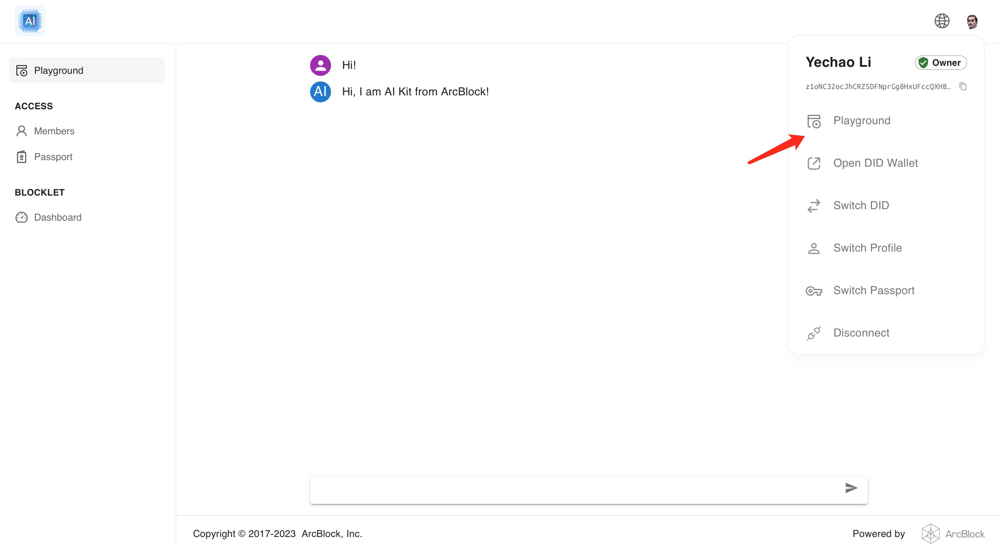

# AI Kit

AI Kit 是一个能够快速集成 AI 的 blocklet。使用 AI Kit，开发者能够轻松的将 AI 功能集成到他们的项目中，并创造强大的应用。

## 特点

- 简单的接口，易于集成 AI 功能到应用中
- 支持常用的 AI 服务提供商，如 OpenAI

## 安装和运行

- 点击 Launch 按钮
- 你需要首先购买一个套件服务器（如果你还没有的话）
- 按照安装向导在套件服务器上安装套件
- 在套件服务器控制台启动已安装的套件
- 在 **Blocklets -> AI Kit -> Components -> AI Kit -> Settings -> Environment** 设置 `OPENAI_API_KEY` 并重启 blocklet
  
- 访问 AI Kit 的公网地址，你可以从管理员账户菜单中打开 Playground
  

## 集成到你的套件

- 将 AI Kit 作为 component 添加到你的 blocklet 中
- 在 `AI Kit` 组件设置中设置 `OPENAI_API_KEY`，并重启你的 blocklet
- 调用 AI Kit 的 api

[AI Kit api 参考](docs/api.md)

## 支持

如果您有任何问题或需要帮助，请随时与我们联系 <liyechao@arcblock.io>。 我们很乐意提供帮助！
